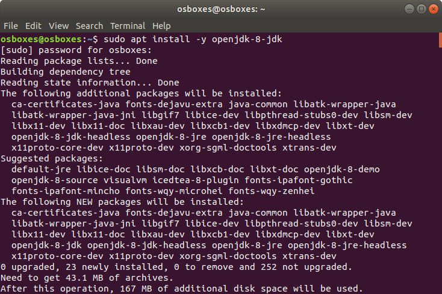

# How to set up single node Hadoop cluster
This tutorial contains detailed steps to set up a single node Hadoop cluster on your own machine.


## Requirements
- Java 8
- [Apache Hadoop](https://hadoop.apache.org/)
- Linux or Mac OS (highly recommended)


## How to


### Install Java 8
The latest Apache Hadoop version is 3.2.1. All Hadoop 3 builds require Java 8.

First you need to check if Java 8 is installed and if `JAVA_HOME` is set, by the following commands:

```bash
echo $JAVA_HOME
java -version
javac -version
```

If `echo $JAVA_HOME` shows no result, you need to set `JAVA_HOME` in the environment. If `java -version` or `javac -version` shows command not found or showing a version different from `1.8.0_xxx`, you need to install Java 8.


To install the latest JDK 8 and JRE 8, run the following commands in Terminal if you are using Debian or Ubuntu:

```bash
sudo apt update
sudo apt install -y openjdk-8-jdk
```



If you are using CentOS, Fedora or Red Hat, use the following commands instead:

```bash
sudo yum update
sudo yum -y install java-1.8.0-openjdk java-1.8.0-openjdk-devel
```

If you are using MacOS, you can download and install the latest JDK 8 (contains JRE 8) from <https://www.oracle.com/technetwork/java/javase/downloads/index.html#JDK8>.


### Install Hadoop 3
Use the following command to install Apache Hadoop 3 globally for all users. You can use a different location if you prefer.

```bash
sudo wget -c http://mirror.metrocast.net/apache/hadoop/common/stable/hadoop-3.2.1.tar.gz -O - | sudo tar -xz -C /opt
```

This will install the latest Apache Hadoop (currently 3.2.1) to ***/opt/***. You may find your fastest link to download from <https://www.apache.org/dyn/closer.cgi/hadoop/common/hadoop-3.2.1/hadoop-3.2.1.tar.gz>.


### Set Environment Variables
After JDK 8, JRE 8 and Hadoop 3 are installed, run the following commands to set `JAVA_HOME` and `HADOOP_HOME` environment variables:

```bash
echo | sudo tee -a /etc/profile > /dev/null
echo "export JAVA_HOME=/usr/lib/jvm/java-8-openjdk-amd64" | sudo tee -a /etc/profile > /dev/null
echo "export HADOOP_HOME=/opt/hadoop-3.2.1" | sudo tee -a /etc/profile > /dev/null
echo "export PATH=\$PATH:\$JAVA_HOME/bin:\$HADOOP_HOME/bin" | sudo tee -a /etc/profile > /dev/null
```


Before editing, the end of ***/etc/profile*** looks like


After editing, the end looks like


These commands make the following changes to ***/etc/profile***:
- Set `JAVA_HOME` to ***/usr/lib/jvm/java-8-openjdk-amd64***. You may need to change this path if you are using a different system.
- Set `HADOOP_HOME` to ***/opt/hadoop-3.2.1***. You may need to change this path if you are using a different Hadoop version, or installed it at a different location.
- Add `$JAVA_HOME/bin` and `$HADOOP_HOME/bin` to `PATH` for the system to locate the executables of JAVA and Hadoop.

If you just want to make these changes for the current user only, you can add the same contents to ***~/.profile*** or user related places.

To make these changes take effect, either run `source /etc/profile`, or restart the system.


### Verify Java 8 and Hadoop 3
Run the following commands:

```bash
echo $JAVA_HOME
java -version
javac -version
echo $HADOOP_HOME
hadoop version
```

The results should be similar to


### Run Example Program
Run the following commands:

```bash
# Remove the old folder if exists
rm -fr hadoop_test
# Create a workspace and cd to it
mkdir hadoop_test
cd hadoop_test
# Create a folder for MapReduce input files
mkdir input
# Copy some text files to the input folder
cp $HADOOP_HOME/etc/hadoop/*.xml input
# Run MapReduce Grep example
# Grep example extracts matching strings from text files and counts how many time they occured
hadoop jar $HADOOP_HOME/share/hadoop/mapreduce/hadoop-mapreduce-examples-3.2.1.jar grep input output 'dfs[a-z.]+'
# Print the output contents
cat output/*
```


## Hadoop on Windows
Running Hadoop on Windows can be tricky and not recommended. I would recommend install Hadoop through virtual machines, for example, [Oracle Virtual Box](https://www.virtualbox.org/) is a free software that supports almost all major host OS.

[OSBoxes](https://www.osboxes.org/) is a very good website that has many VM images to download, so you don't have to spend time installing a guest OS on your VM.

There are some good tutorials about how to install and configure Hadoop on Windows, for example, [Installing and Running Hadoop and Spark on Windows](https://dev.to/awwsmm/installing-and-running-hadoop-and-spark-on-windows-33kc).


## References
- [Install OpenJDK 8 on Ubuntu Trusty](https://www.geofis.org/en/install/install-on-linux/install-openjdk-8-on-ubuntu-trusty/)
- [How To Install Java on CentOS and Fedora](https://www.digitalocean.com/community/tutorials/how-to-install-java-on-centos-and-fedora)
- [Installing the JDK Software and Setting JAVA_HOME](https://docs.oracle.com/cd/E19182-01/821-0917/inst_jdk_javahome_t/index.html)
- [Hadoop: Setting up a Single Node Cluster.](https://hadoop.apache.org/docs/stable/hadoop-project-dist/hadoop-common/SingleCluster.html)
